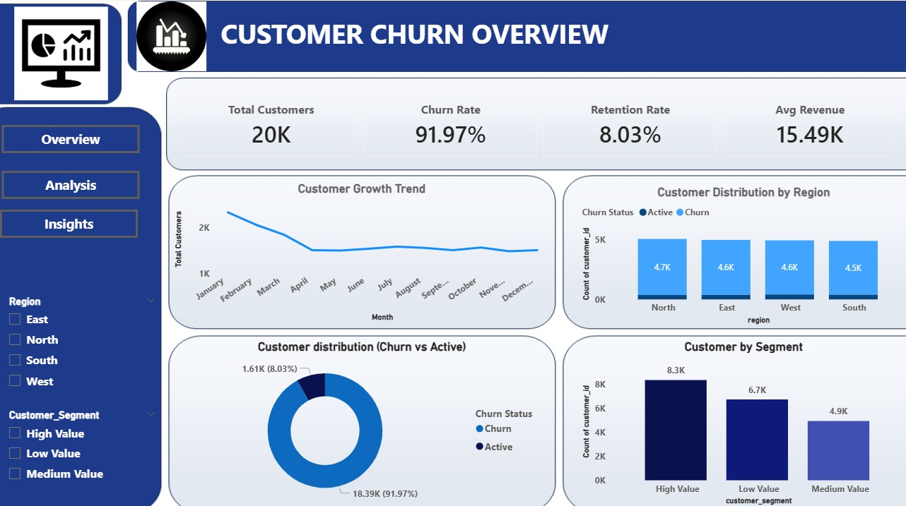
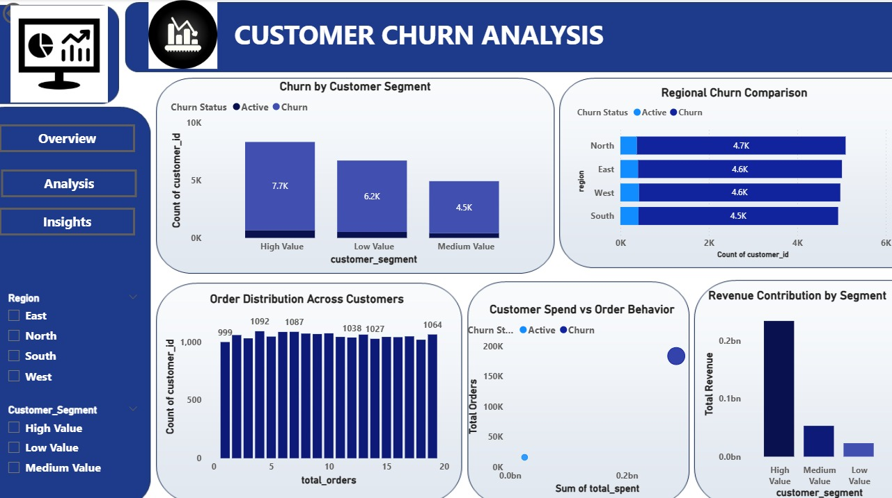
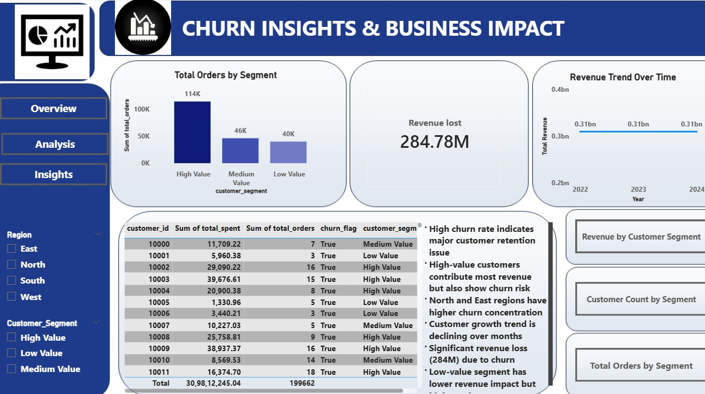

# Customer Churn Analysis

## Project Overview
This project analyzes customer churn patterns and identifies key factors affecting customer retention using Python, SQL, and Power BI.

## Objectives
- Identify customers likely to churn
- Analyze customer behavior and trends
- Support business decisions for improving retention

## Key Insights
- High churn rate observed indicating retention challenges
- Identified high-risk customer segments impacting retention
- Customer behavior significantly influences churn and revenue

## Tools Used
- Python
- SQL
- Power BI
- Excel

## Process
- Data cleaning and preprocessing
- Exploratory Data Analysis (EDA)
- Customer segmentation
- Dashboard development in Power BI

## Dashboard Preview

